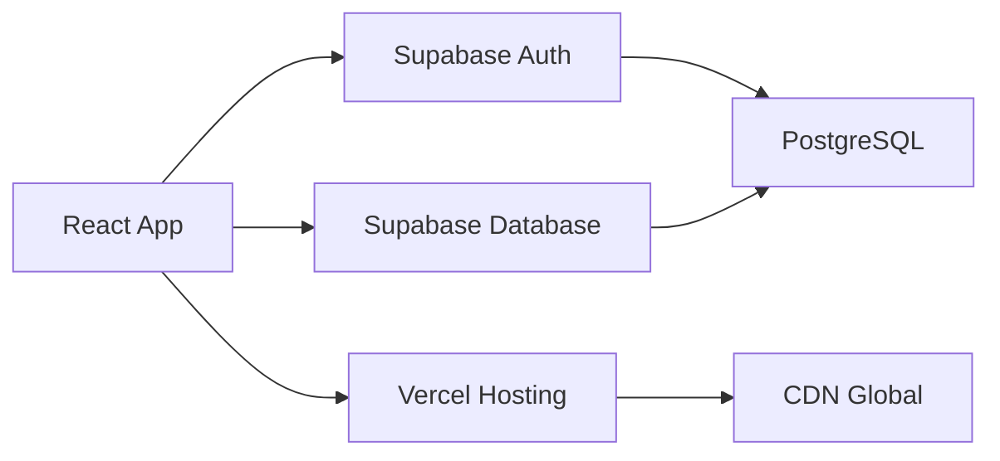

<div align="center">

# Control Horario

### Sistema de Control de Jornada Laboral

[](https://github.com/AzTTeK)
[](https://vercel.com)
[](https://supabase.com)


</div>

---

## Descripcion

**Control Horario** es una aplicacion web moderna para el registro y seguimiento de la jornada laboral. Permite a los empleados fichar entradas y salidas, gestionar pausas, y visualizar estadisticas detalladas de sus horas trabajadas.


</div>

---

## Funcionalidades

| Modulo | Descripcion |
|--------|-------------|
| **Autenticacion** | Registro, login y recuperacion de contrasena con Supabase Auth |
| **Fichaje** | Clock-in/Clock-out con registro de hora exacta |
| **Pausas** | Gestion de pausas (comida, descanso, otras) |
| **Dashboard** | Visualizacion de estadisticas semanales y mensuales |
| **Historial** | Registro completo de todas las jornadas |
| **Reportes** | Generacion de informes de horas trabajadas |
| **Perfil** | Gestion de datos personales del usuario |
| **Tema Oscuro** | Soporte completo para modo oscuro/claro |

---

## Stack Tecnologico

<div align="center">

| Frontend | Backend | Herramientas |
|----------|---------|--------------|
|  |  |  |
|  |  |  |
|  | |  |
|  | | |
|  | | |

</div>

---

## Arquitectura del Proyecto

```
src/
├── components/
│   ├── auth/              # Componentes de autenticacion
│   │   ├── LoginForm.tsx
│   │   ├── RegisterForm.tsx
│   │   ├── ForgotPasswordForm.tsx
│   │   └── ProtectedRoute.tsx
│   ├── dashboard/         # Componentes del dashboard
│   │   ├── StatsCard.tsx
│   │   └── WeeklyChart.tsx
│   ├── layout/            # Layout de la aplicacion
│   │   ├── Header.tsx
│   │   ├── Layout.tsx
│   │   └── Sidebar.tsx
│   └── time-tracking/     # Control de tiempo
│       ├── CurrentStatus.tsx
│       ├── PauseControls.tsx
│       └── TimeClockControls.tsx
├── contexts/              # Context API
│   ├── AuthContext.tsx
│   ├── ThemeContext.tsx
│   └── TimeTrackingContext.tsx
├── lib/                   # Utilidades y configuracion
│   ├── calculations.ts
│   ├── supabase.ts
│   └── utils.ts
├── pages/                 # Paginas de la aplicacion
│   ├── Dashboard.tsx
│   ├── History.tsx
│   ├── Profile.tsx
│   └── Reports.tsx
└── types/                 # Definiciones de tipos
    └── index.ts
```

---

## Instalacion

### Requisitos previos

- Node.js 18+
- npm o pnpm
- Cuenta en Supabase

### Pasos

```bash
# Clonar el repositorio
git clone https://github.com/AzTTeK/ControlHorario.git
cd ControlHorario

# Instalar dependencias
npm install

# Configurar variables de entorno
cp .env.example .env.local
# Editar .env.local con tus credenciales de Supabase

# Iniciar en desarrollo
npm run dev
```

### Variables de Entorno

```env
VITE_SUPABASE_URL=https://tu-proyecto.supabase.co
VITE_SUPABASE_ANON_KEY=tu-anon-key
```

---

## Scripts Disponibles

| Comando | Descripcion |
|---------|-------------|
| `npm run dev` | Inicia el servidor de desarrollo |
| `npm run build` | Compila la aplicacion para produccion |
| `npm run preview` | Previsualiza el build de produccion |
| `npm run lint` | Ejecuta ESLint |

---

## Despliegue

La aplicacion esta desplegada en **Vercel** con integracion continua desde GitHub.

[](https://vercel.com/new/clone?repository-url=https://github.com/AzTTeK/ControlHorario)

---

## Contribuciones

<div align="center">

[](https://github.com/AzTTeK/ControlHorario/graphs/contributors)
[](https://github.com/AzTTeK/ControlHorario/commits)
[](https://github.com/AzTTeK/ControlHorario/commits)

</div>

### Autor Principal

<div align="center">

[](https://github.com/AzTTeK)

[](https://github.com/AzTTeK)

</div>

---

## Estado del Proyecto

<div align="center">

[](https://github.com/AzTTeK/ControlHorario/actions)
[](https://github.com/AzTTeK/ControlHorario/issues)
[](https://github.com/AzTTeK/ControlHorario/pulls)
[](https://github.com/AzTTeK/ControlHorario/blob/main/LICENSE)

</div>

---

## Integraciones

<div align="center">



</div>

| Servicio | Uso | Estado |
|----------|-----|--------|
| **Supabase Auth** | Autenticacion de usuarios |  |
| **Supabase Database** | Almacenamiento de datos |  |
| **Vercel** | Hosting y CI/CD |  |
| **GitHub** | Control de versiones |  |

---

## Licencia

Este proyecto esta bajo la Licencia MIT. Ver el archivo [LICENSE](LICENSE) para mas detalles.

---

<div align="center">

**Desarrollado con** :heart: **por [AzTTeK](https://github.com/AzTTeK)**

[](https://github.com/AzTTeK)
[](https://github.com/AzTTeK/ControlHorario)

</div>
